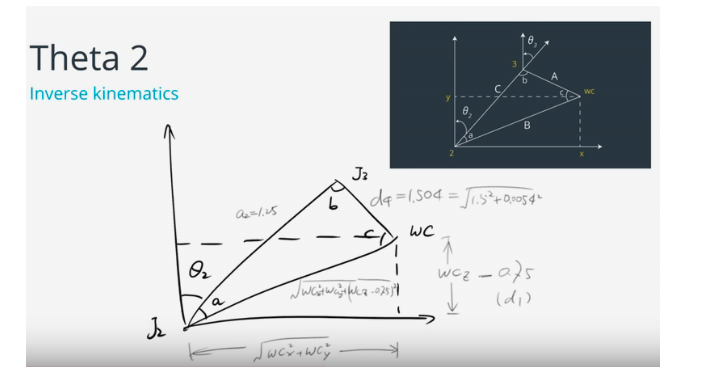

## Project: Kinematics Pick & Place

### First Project for Udacity Robotics Software Engineering ND 2019

---

**Brief Information**


This project uses KUKA KR210 - 6 DOF serial manipulator to pick up an object from shelves, and drop it to a bin standing next to the manipulator. 

## 1) Setting Up The Environment

To set up the environment succesfully, please have a look at this guide. 

https://github.com/udacity/RoboND-Kinematics-Project/blob/master/README.md

## 2) Kinematics Problem

### 2.1. Setup DH Parameter Table 

Step 1 is the completing DH Parameter table while solving inverse kinematics problem. 

 

To calculate DH table, upper image was taken as reference, because all joints' and links' axes and the distances between joints can be seen clearly. 

Additionally while creating this table, URDF robot KUKA KR210 is taken into consideration. 

The URDF file is located at "*kuka_arm/urdf/kr210.urdf.xacro*" ***xacro*** stands for XML Macros. More information can be found at:  *http://wiki.ros.org/xacro*

From URDF file, all joint's coordinates & axes are taken: 

|   Joint   |   x   |  y   |   z    |
| :-------: | :---: | :--: | :----: |
| base_link |   0   |  0   |   0    |
|  joint_1  |   0   |  0   |  0.33  |
|  joint_2  | 0.35  |  0   |  0.42  |
|  joint_3  |   0   |  0   |  1.25  |
|  joint_4  | 0.96  |  0   | -0.054 |
|  joint_5  | 0.54  |  0   |   0    |
|  joint_6  | 0.193 |  0   |   0    |

From upper image & table our DH Table becomes: 

```python
    # Define DH Transformation Matrix
	DH_Table = {alpha0: 0, 	a0: 0, 		    d1: 0.75, 	q1: q1,
		alpha1: -pi/2.,     a1: 0.35,	    d2: 0, 		q2: -pi/2. + q2,
		alpha2: 0, 	        a2: 1.25, 	    d3: 0, 		q3: q3,
		alpha3: -pi/2.,     a3: -0.054, 	d4: 1.5, 	q4: q4,
		alpha4: pi/2, 	    a4: 0, 		    d5: 0, 		q5: q5,
		alpha5: -pi/2.,     a5: 0, 		    d6: 0, 		q6: q6,
		alpha6: 0, 	        a6: 0, 		    d7: 0.303, 	q7: 0}
```

*Note: q -> Θ in the code*  

## 2.2. Joint Based Transformation Matrices

The transformation matrix can be calculated by substituting the DH parameters from the table above into this matrix by applying mathematical expressions: 


```python
        # Define transformation matrix with respect to DH Parameters
    	def TF_Matrix(alpha, a, d, q):
            TF = Matrix([
			[cos(q), 		-sin(q), 		0, 		a],
	     	[sin(q)*cos(alpha), 	cos(q)*cos(alpha), 	-sin(alpha), 	-sin(alpha)*d],
	     	[sin(q)* sin(alpha), 	cos(q)*sin(alpha), 	cos(alpha), 	cos(alpha)*d],
	     	[0,			0,			0,		1]
		   ])
            return TF
```

A function is used for ease of calculation.

```python
        T0_1 = TF_Matrix(alpha0, a0, d1, q1).subs(DH_Table)
        T1_2 = TF_Matrix(alpha1, a1, d2, q2).subs(DH_Table)
        T2_3 = TF_Matrix(alpha2, a2, d3, q3).subs(DH_Table)
        T3_4 = TF_Matrix(alpha3, a3, d4, q4).subs(DH_Table)
        T4_5 = TF_Matrix(alpha4, a4, d5, q5).subs(DH_Table)
        T5_6 = TF_Matrix(alpha5, a5, d6, q6).subs(DH_Table)
        T6_EE = TF_Matrix(alpha6, a6, d7, q7).subs(DH_Table)
```

Then, transformation matrix from base_link to end_effector is calculated: 

```python
# Transformation matrix from the base_link to end_effector 
    	T0_EE = simplify(T0_1 * T1_2 * T2_3 * T3_4 * T4_5 * T5_6 * T6_EE)
```

## 2.3. Inverse Kinematics

Wrist center calculated with the formula below:

​	

But to calculate WC, firstly rotation of end effector matrix depending on roll, pitch and yaw must be created:

```python
# Smybolize roll, pitch and yaw as r,p,y
      r, p , y = symbols('r p y')
      # Create rotation matrix with respect to roll
      ROT_x = Matrix([[1, 0 , 0],
					[0, cos(r), -sin(r)],
      				[0, sin(r), cos(r)]])
      
      # Create rotation matrix with respect to pitch
      ROT_y = Matrix([[cos(p),   	0 ,    sin(p)],
      				[0,       		1,     	0],
      				[-sin(p),  		0,     cos(p)]]) 
     
     # Create rotation matrix with respect to yaw
      ROT_z = Matrix([[cos(y), -sin(y), 0],
      				[sin(y), cos(y), 0],
      				[0, 0, 1]]) 
             
     # Calculate End Effector's Rotation Matrix
        ROT_EE = simplify(ROT_z * ROT_y * ROT_x)
     # Correction for KUKA KR210 
     # This correction is made for difference between gripper, 
        Rot_Error = ROT_z.subs(y, radians(180)) * ROT_y.subs(p, radians(-90))
        ROT_EE = simplify(ROT_EE * Rot_Error)
```

*`Rot_Error`* comes from the difference of frames between the gripper reference frame as defined in URDF vs. the DH parameters. To overcome this issue, it's suggested about to rotate Z axis then X axis. 


Since we have `ROT_EE` we can calculate, Wrist Center: 

```python
ROT_EE = ROT_EE.subs({'r': roll, 'p': pitch, 'y': yaw})
# End effector position matrix 
EE = Matrix([[px], [py], [pz]])
# Wrist center calculation
WC = EE - (0.303) * ROT_EE[:,2]
```

 Next step after WC calculation is to find joint angles (theta1,2,3): 

*Calculating theta1:*

```python
theta1 = atan2(WC[1], WC[0])
```


> Image: Udacity 

*Calculating theta2:*



> Image: Udacity 


> Image: Udacity 


Theta4, Theta5 and Theta6 is obtained from R3_6 rotation matrix. 

Recall lecture: [Euler Angles From Rotation Matrix](https://classroom.udacity.com/nanodegrees/nd209-ent/parts/da3b7b6d-9e5c-469a-91c6-a603f684f7aa/modules/1ef35d9c-1ec1-4bb9-8d1f-df42bf4bc4cf/lessons/87c52cd9-09ba-4414-bc30-24ae18277d24/concepts/a124f98b-1ed5-45f5-b8eb-6c40958c1a6b)


$$
β=atan2(y,x)=atan2(−r31,r11∗r11+r21∗r21),
γ=atan2(r32,r33),
α=atan2(r21,r11)
$$
Corresponding code block is: 

```python
# Calculate Euler angles from rotation matrices 
theta4 = atan2(R3_6[2,2], -R3_6[0,2])
theta5 = atan2(sqrt(R3_6[0,2]*R3_6[0,2] + R3_6[2,2]*R3_6[2,2]), R3_6[1,2])
theta6 = atan2(-R3_6[1,1], R3_6[1,0])
```

Note that there are two possible solutions when finding theta5. It comes from the square root function. 
$$
sqrt(R3_6[0,2]*R3_6[0,2])
$$


Code for inverse kinematics solution & algorithm can be seen below:

```python
# Calculating joint angles using geometric IK method 
side_a = 1.501 #from link dimension
side_b = sqrt(pow(sqrt(WC[0] * WC[0] + WC[1] * WC[1]) - 0.35, 2)+ pow((WC[2] - 0.75), 2))
side_c = 1.25 # from link dimension

angle_a = acos((side_b * side_b + side_c * side_c - side_a * side_a) / (2 * side_b * side_c))
angle_b = acos((side_a * side_a + side_c * side_c - side_b * side_b) / (2 * side_a * side_c))
angle_c = acos((side_a * side_a + side_b * side_b - side_c * side_c ) / (2 * side_a * side_b))

theta1 = atan2(WC[1], WC[0])
theta2 = pi / 2 - angle_a - atan2(WC[2] - 0.75, sqrt(WC[0] * WC[0] + WC[1] * WC[1]) - 0.35)
theta3 = pi / 2 - (angle_b + 0.036)  # 0.036 accounts for sag in link4 of -0.054m

# Once we have theta1,2,3 we can build the rotation matrix 
R0_3 = T0_1[0:3,0:3] * T1_2[0:3,0:3] * T2_3[0:3,0:3]
R0_3 = R0_3.evalf(subs={q1: theta1, q2:theta2, q3: theta3})
R3_6 = R0_3.transpose()* ROT_EE

# Calculate Euler angles from rotation matrices 
theta4 = atan2(R3_6[2,2], -R3_6[0,2])
theta5 = atan2(sqrt(R3_6[0,2]*R3_6[0,2] + R3_6[2,2]*R3_6[2,2]), R3_6[1,2])
theta6 = atan2(-R3_6[1,1], R3_6[1,0])
```

## 3. Successful Jobs done by KUKA KR210

KUKA KR210 robot, successfully completed the job with 8 of 8. 

Images can be found in `images` folder


## 4. Project Implementation 

### Import section

This section imports required libraries & modules to code run properly

```python
import rospy # imports ros library
import tf # imports the library for transformations from Quaternians -> Euler angles
from kuka_arm.srv import * #import server
from trajectory_msgs.msg import JointTrajectory, JointTrajectoryPoint #import ros message type
from geometry_msgs.msg import Pose  #import ros message type
from mpmath import * #import mpmath functions
from sympy import * #import sympy for symbolic processes
from tf import transformations # import transformations from tf
```

### Define symbols

Before getting into action, all symbolizing code block taken out as global. This is done due to code review.  

```python
# These block taken out to make code faster
# According to the code review
# Smybolize roll, pitch and yaw as r,p,y
r, p, y = symbols('r p y')
# Define DH Parameters
d1, d2, d3, d4, d5, d6, d7 = symbols('d1:8')
a0, a1, a2, a3, a4, a5, a6 = symbols('a0:7')
alpha0, alpha1, alpha2, alpha3, alpha4, alpha5, alpha6 = symbols('alpha0:7')
q1, q2, q3, q4, q5, q6, q7 = symbols('q1:8')
```

### Define TF Matrix Function

To avoid from nested functions TF_Matrix function is taken out from the IK Server scope.

```python
# Define transformation matrix with respect to DH Parameters
def TF_Matrix(alpha, a, d, q):
    TF = Matrix([[cos(q),     -sin(q),      0,        a],
           [sin(q)*cos(alpha),   cos(q)*cos(alpha),     -sin(alpha),   -sin(alpha)*d],
           [sin(q)* sin(alpha),  cos(q)*sin(alpha),     cos(alpha),    cos(alpha)*d],
           [0,         0,       0,    1]])
    return TF
```

### Handling IK Server

This is the callback function runs when a request is sent to the server.

```python
def handle_calculate_IK(req):
    rospy.loginfo("Received %s eef-poses from the plan" % len(req.poses))
    if len(req.poses) < 1:
        print ("No valid poses received")
        return -1
    else:
```

### Define DH Table 

DH table is created by using dictionary data structure. 

```python
      # Inverse Kinematic Problem Starts Here 
      # Define DH Transformation Matrix
DH_Table = {alpha0: 0,   	a0: 0,            	d1: 0.75,  		q1: q1,
alpha1: -pi/2.,         	a1: 0.35,      		d2: 0,        	q2: -pi/2. + q2,
alpha2: 0,                 	a2: 1.25,      		d3: 0,        	q3: q3,
alpha3: -pi/2.,         	a3: -0.054,    		d4: 1.5,   		q4: q4,
alpha4: pi/2,          		a4: 0,            	d5: 0,        	q5: q5,
alpha5: -pi/2.,         	a5: 0,            	d6: 0,        	q6: q6,
alpha6: 0,                 	a6: 0,            	d7: 0.303,     	q7: 0}
     
```

### Creating Individual Transformation Matrices

```python
# Creating individual transformation matrices
T0_1 = TF_Matrix(alpha0, a0, d1, q1).subs(DH_Table)
T1_2 = TF_Matrix(alpha1, a1, d2, q2).subs(DH_Table)
T2_3 = TF_Matrix(alpha2, a2, d3, q3).subs(DH_Table)
T3_4 = TF_Matrix(alpha3, a3, d4, q4).subs(DH_Table)
T4_5 = TF_Matrix(alpha4, a4, d5, q5).subs(DH_Table)
T5_6 = TF_Matrix(alpha5, a5, d6, q6).subs(DH_Table)
T6_EE = TF_Matrix(alpha6, a6, d7, q7).subs(DH_Table)
```

From base_link to end_effector transformation matrix is calculated by, 

```python
   # Transformation matrix from the base_link to end_effector 
T0_EE = simplify(T0_1 * T1_2 * T2_3 * T3_4 * T4_5 * T5_6 * T6_EE)
```

### Calculate End Effector's Rotation Matrix

To Calculate End Effector's Rotation Matrix roll, pitch and yaw angles taken into consideration by creation rotation matrices due to x,y,z axes.

```python
      # Create rotation matrix with respect to roll
      ROT_x = Matrix([[1, 0 , 0],
[0, cos(r), -sin(r)],
      [0, sin(r), cos(r)]])
      
      # Create rotation matrix with respect to pitch
      ROT_y = Matrix([
[cos(p),   0 ,    sin(p)],
[0,       1,     0],
      [-sin(p),  0,     cos(p)]]) 
      
      # Create rotation matrix with respect to yaw
      ROT_z = Matrix([[cos(y), -sin(y), 0],
[sin(y), cos(y), 0],
[0, 0, 1]]) 

      # Calculate End Effector's Rotation Matrix
      ROT_EE = simplify(ROT_z * ROT_y * ROT_x)
```

### Correction for End Effector

In order to match with URDF and the end effector's orientation has to be corrected by rotating 180 degrees around the Z axis and -90 degrees around the Y axis.

```python
# Correction for KUKA KR210 
# This correction is made for difference between gripper, 
Rot_Error = ROT_z.subs(y, radians(180)) * ROT_y.subs(p, radians(-90))
ROT_EE = simplify(ROT_EE * Rot_Error)
```

### Initialize Service Response

Initialize service response and take roll, pitch and yaw data  from request and transform it 

```python
   # Initialize service response
   joint_trajectory_list = []
   for x in xrange(0, len(req.poses)):
       # IK code starts here
       joint_trajectory_point = JointTrajectoryPoint()

   # Extract end-effector position and orientation from request
# px,py,pz = end-effector position
# roll, pitch, yaw = end-effector orientation
       px = req.poses[x].position.x
       py = req.poses[x].position.y
       pz = req.poses[x].position.z

       (roll, pitch, yaw) = tf.transformations.euler_from_quaternion(
           [req.poses[x].orientation.x, req.poses[x].orientation.y,
               req.poses[x].orientation.z, req.poses[x].orientation.w])
```

### End Effector's Position & Orientation 

End effector's position and orientation is found with substituting roll, pitch and yaw data. 

```python
# Calculate end effectors's rotation matrix
ROT_EE = ROT_EE.subs({'r': roll, 'p': pitch, 'y': yaw})
# End effector position matrix 
EE = Matrix([[px], [py], [pz]])
```

### WC & Euler Angles Calculation

Position of the Wrist Center is found then theta1, theta2, theta3 are calculated using geometric inverse kinematics method.

```python
# Calculating joint angles using geometric IK method 
side_a = 1.501 #from link dimension
side_b = sqrt(pow(sqrt(WC[0] * WC[0] + WC[1] * WC[1]) - 0.35, 2)+ pow((WC[2] - 0.75), 2))
side_c = 1.25 # from link dimension

angle_a = acos((side_b * side_b + side_c * side_c - side_a * side_a) / (2 * side_b * side_c))
angle_b = acos((side_a * side_a + side_c * side_c - side_b * side_b) / (2 * side_a * side_c))
angle_c = acos((side_a * side_a + side_b * side_b - side_c * side_c ) / (2 * side_a * side_b))

theta1 = atan2(WC[1], WC[0])
theta2 = pi / 2 - angle_a - atan2(WC[2] - 0.75, sqrt(WC[0] * WC[0] + WC[1] * WC[1]) - 0.35)  
theta3 = pi / 2 - (angle_b + 0.036)  # 0.036 accounts for sag in link4 of -0.054m
```

Once we have theta1,2,3 we can build the rotation matrix.

```python
R0_3 = T0_1[0:3,0:3] * T1_2[0:3,0:3] * T2_3[0:3,0:3]
R0_3 = R0_3.evalf(subs={q1: theta1, q2:theta2, q3: theta3})
R3_6 = R0_3.transpose() * ROT_EE

```

Then we must calculate Euler angles theta4,5,6 from R3_6:

```python
# Calculate Euler angles from rotation matrices 
theta5 = atan2(sqrt(R3_6[0,2]*R3_6[0,2] + R3_6[2,2]*R3_6[2,2]), R3_6[1,2])
#select best solution for theta4 & theta5
if theta5 >pi:
    theta4 = atan2(-R3_6[2,2], R3_6[0,2])
    theta6 = atan2(R3_6[1,1], -R3_6[1,0])
else:
    theta4 = atan2(R3_6[2, 2], -R3_6[0, 2])
    theta6 = atan2(-R3_6[1, 1], R3_6[1, 0])
```

In here since `sqrt()` function is used, there will be returned two values such positive and negative respectively, to handle this an `if` block is used. The code can be seen below: 

```python
if theta5 >pi:
    theta4 = atan2(-R3_6[2,2], R3_6[0,2])
    theta6 = atan2(R3_6[1,1], -R3_6[1,0])
else:
    theta4 = atan2(R3_6[2, 2], -R3_6[0, 2])
    theta6 = atan2(-R3_6[1, 1], R3_6[1, 0])
```

Theta values are populated for the response:

```python
joint_trajectory_point.positions = [theta1, theta2, theta3, theta4, theta5, theta6]
joint_trajectory_list.append(joint_trajectory_point)

rospy.loginfo("length of Joint Trajectory List: %s" % len(joint_trajectory_list))
return CalculateIKResponse(joint_trajectory_list)
```

### Server Node Initialization

```python
def IK_server():
    # initialize node and declare calculate_ik service
    rospy.init_node('IK_server')
    s = rospy.Service('calculate_ik', CalculateIK, handle_calculate_IK)
    print("Ready to receive an IK request")
    rospy.spin()
```

### Start Point of the Program

Program is started by using main: 

```python
if __name__ == "__main__":
    IK_server()
```

## 5. Summary

If we look at the from the point of view of speed, I can't say that my code runs fast. The reason behind this problem can be the usage of symbols in the code not in proper positions. This will be updated on the upcoming days. 

As a point of view of Wrist Center it has a stable position but I can't say that for rotation. This may be because there is more than one possible solutions for inverse orientation problem. 


